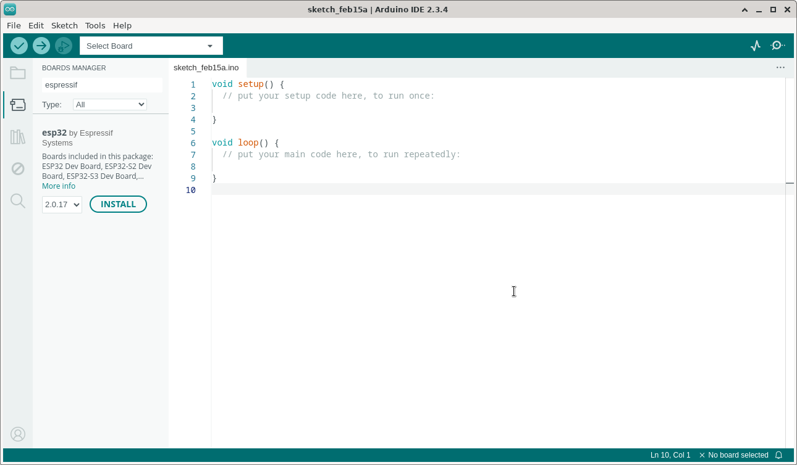
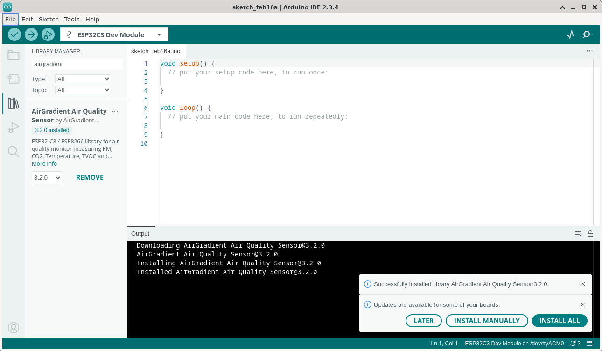
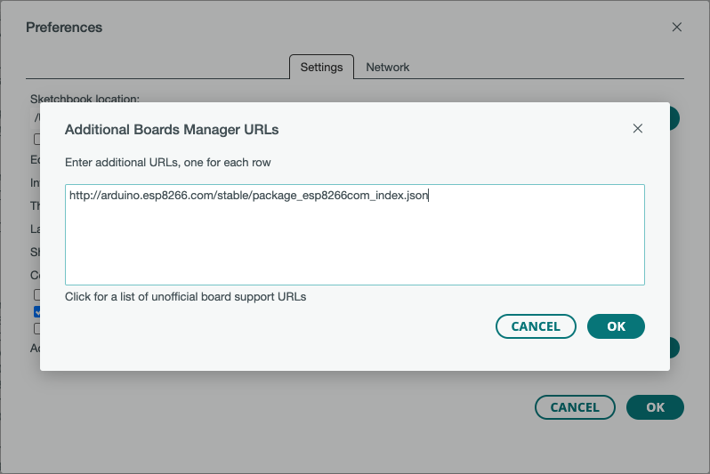
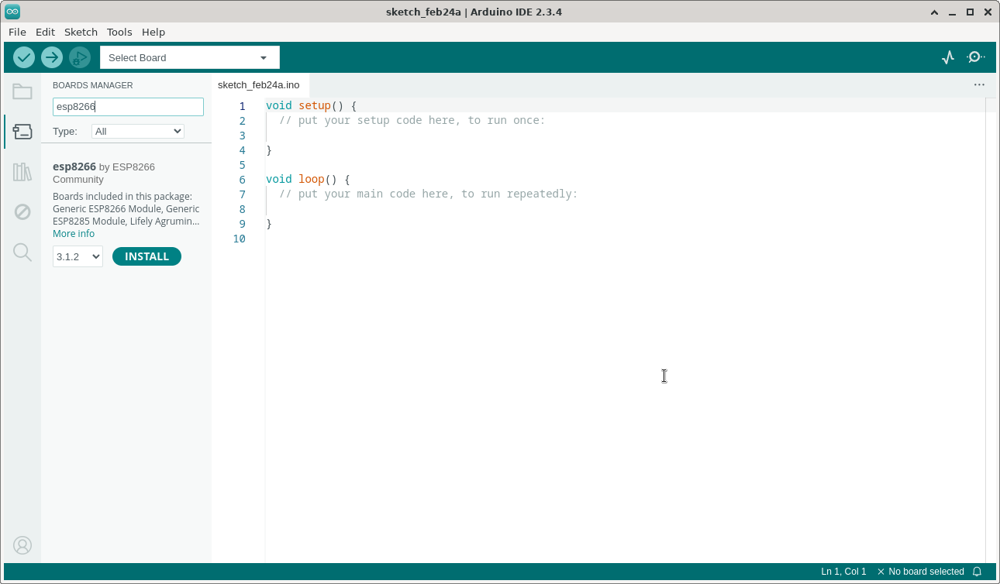
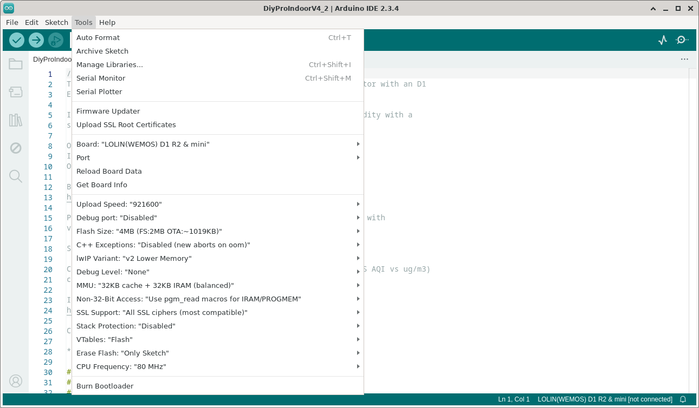
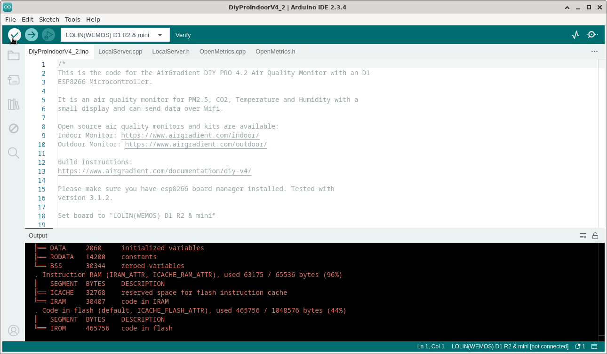
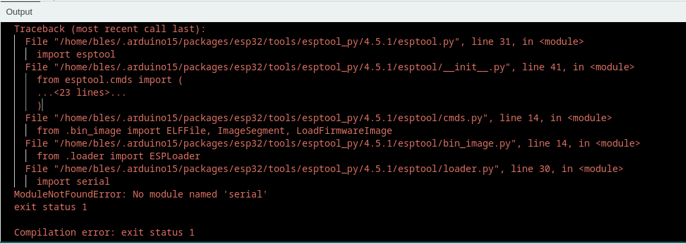

# How to compile AirGradient firmware on Arduino IDE

## Prequisite

Arduino IDE version 2.x ([download](https://www.arduino.cc/en/software))

> For AirGradient model ONE and Open Air, the codebase **WILL NOT** work on the latest major version of arduino-esp32 which is *3.x* . This related to when installing "esp32 by Espressif Systems" in board manager. Instead use version **2.0.17**, please follow the first step carefully.

## Steps for ESP32C3 based board (ONE and Open Air Model)

1. Install "esp32 by Espressif Systems" in board manager with version **2.0.17** (Tools ➝ Board ➝ Boards Manager ➝ search for `"espressif"`)



2. Install AirGradient library

#### Version < 3.2.0

Using library manager install the latest version (Tools ➝ Manage Libraries... ➝ search for `"airgradient"`)



#### Version >= 3.3.0

- From your terminal, go to Arduino libraries folder (windows and mac: `Documents/Arduino/libraries` or linux: `~/Arduino/Libraries`).
- With **git** cli, execute this command `git clone --recursive https://github.com/airgradienthq/arduino.git AirGradient_Air_Quality_Sensor`
- Restart Arduino IDE

3. On tools tab, follow settings below

```
Board ➝ ESP32C3 Dev Module
USB CDC On Boot ➝ Enabled
CPU Frequency ➝ 160MHz (WiFi)
Core Debug Level ➝ Info
Erase All Flash Before Sketch Upload ➝ Enabled (or choose as needed)
Flash Frequency ➝ 80MHz
Flash Mode ➝ QIO
Flash Size ➝ 4MB (32Mb)
JTAG Adapter ➝ Disabled
Partition Scheme ➝ Minimal SPIFFS (1.9MB APP with OTA/190KB SPIFFS)
Upload Speed ➝ 921600
```

4. Open sketch to compile (File ➝ Examples ➝ AirGradient Air Quality Sensor ➝ OneOpenAir). This sketch for AirGradient ONE and Open Air monitor model
5. Compile


## Steps for ESP8266 based board (DIY model)

1. Add esp8266 board by adding http://arduino.esp8266.com/stable/package_esp8266com_index.json into Additional Board Manager URLs field (File ➝ Preferences ➝ Additional boards manager URLs)



2. Install esp8266 board on board manager with version **3.1.2** (Tools ➝ Board ➝ Boards Manager ➝ search for `"esp8266"`)



3. Install AirGradient library on library manager using the latest version (Tools ➝ Manage Libraries... ➝ search for `"airgradient"`)


4. On tools tab, set board to `LOLIN(WEMOS) D1 R2 & mini`, and let other settings to default



5. Open sketch to compile (File ➝ Examples ➝ AirGradient Air Quality Sensor ➝ `<Model Option>`). Depends on the DIY model, either `BASIC`, `DiyProIndoorV3_3` and `DiyProIndoorV4_2`
6. Compile



## Possible Issues

### Linux (Debian)

ModuleNotFoundError: No module named ‘serial’



Make sure python pyserial module installed globally in the environment by executing:

`$ sudo apt install -y python3-pyserial`

or

`$ pip install pyserial`

Choose based on how python installed on your machine. But most user, using `apt` is better.

## How to contribute

The instructions above are the instructions for how to build an official release of the AirGradient firmware using the Arduino IDE. If you intend to make changes which you plan to contribute back to the main project, instead of installing the AirGradient library, check out the repository at Documents/Arduino/libraries (for Windows and Mac) or ~/Arduino/libraries (for Linux). If you installed the library, you can remove it from the library manager in the Arduino IDE, or just delete the directory.

**NOTE:** When cloning the repository, for version >= 3.3.0 it has submodule, please use `--recursive` flag like this: `git clone --recursive https://github.com/airgradienthq/arduino.git AirGradient_Air_Quality_Sensor`

Please follow github [contributing to a project](https://docs.github.com/en/get-started/exploring-projects-on-github/contributing-to-a-project) tutorial to contribute to this project.

There are 2 environment options to compile this project, PlatformIO and ArduinoIDE.

- For PlatformIO, it should work out of the box
- For arduino, files in `src` folder and also from `Examples` can be modified at `Documents/Arduino/libraries` for Windows and Mac, and `~/Arduino/Libraries` for Linux
