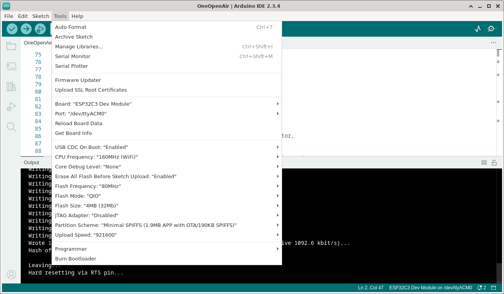

# How to compile AirGradient firmware on Arduino IDE

## Prequisite

Arduino IDE version 2.x ([download](https://www.arduino.cc/en/software))

## Steps for ESP32C3 based board (ONE and Open Air Model)

1. Install "esp32 by Espressif Systems" in board manager with version **2.0.17** (Tools ➝ Board ➝ Boards Manager ➝ search for `"espressif"`)


2. Install AirGradient library on library manager using the latest version (Tools ➝ Manage Libraries... ➝ search for `"airgradient"`) 


3. On tools tab, follow settings below

```
Board ➝ ESP32C3 Dev Module
USB CDC On Boot ➝ Enabled
CPU Frequency ➝ 160MHz (WiFi)
Core Debug Level ➝ None (or choose as needed)
Erase All Flash Before Sketch Upload ➝ Enabled (or choose as needed)
Flash Frequency ➝ 80MHz
Flash Mode ➝ QIO
Flash Size ➝ 4MB (32Mb)
JTAG Adapter ➝ Disabled
Partition Scheme ➝ Minimal SPIFFS (1.9MB APP with OTA/190KB SPIFFS)
Upload Speed ➝ 921600
```



4. Open sketch to compile (File ➝ Examples ➝ AirGradient Air Quality Sensor ➝ OneOpenAir). This sketch for AirGradient ONE and Open Air monitor model
5. Compile


## Steps for ESP8266 based board (DIY model)

1. Add esp8266 board by adding http://arduino.esp8266.com/stable/package_esp8266com_index.json into Additional Board Manager URLs field (File ➝ Preferences ➝ Additional boards manager URLs)


2. Install esp8266 board on board manager with version **3.1.2** (Tools ➝ Board ➝ Boards Manager ➝ search for `"esp8266"`)


3. On tools tab, set board to `LOLIN(WEMOS) D1 R2 & mini`, and let other settings to default


4. Open sketch to compile (File ➝ Examples ➝ AirGradient Air Quality Sensor ➝ `<Model Option>`). Depends on the DIY model, either `BASIC`, `DiyProIndoorV3_3` and `DiyProIndoorV4_2` 
5. Compile


## Possible Issues

### Linux (Debian)

ModuleNotFoundError: No module named ‘serial’

Make sure python pyserial module installed globally in the environment by executing: 

`$ pip install pyserial`