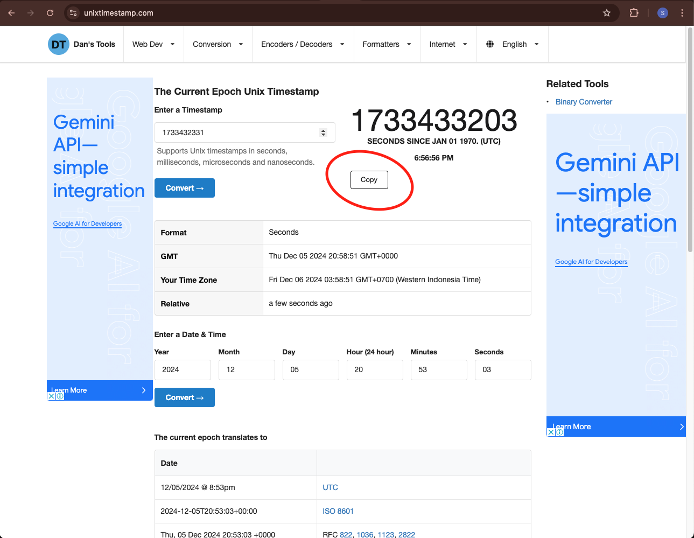

*This document to explain local storage mode - experimental*

## How it works?

1. Monitor directly goes to local storage mode
2. On boot, monitor will attempt to connect to default wifi. And if connected, mdns and local server will be enabled, otherwise it will ignore and continues the measurements
3. On display, when boot it will show the mode ("local storage mode") and wifi related scenario. After that, monitor will show the measurements dashboard 
4. Measurement records to the local storage every two minutes that saved on CSV file in SPIFFs partition
5. Every successful writes, monitor will blink the most left led bar to *blue* twice, but if failed it will blink *red* twice. There are two possibilities for failed write, SPIFFs partition already full or out of heap memory when load the file.
6. There are 2 endpoinds added for this mode, download measurements from local storage and reset measurement (delete old measurements file and create new one) with new timestamp. Timestamp here to set the monitor system time.

**Notes**

1. Default wifi
    - ssid ➝ `airgradient`
    - password ➝ `cleanair`
2. Maximum measurements file is around 113kb. If assume each measurements is 60 bytes, with write schedule 2 minutes, SPIFFS will be full in around 5 days.

### Local Storage Endpoinds

*Make sure monitor is connected to AP, and client also connect to it*

**Download measurements file**

To download measurements file from local storage, just directly access following url on the browser `http://airgradient_aaaaaaaa.local/storage`, and browser should automatically download the file.  

**Reset measurements**

Execure below command in terminal

```sh
curl -X PUT -H "Content-Type: text/plain" -d '1733431986' http://airgradient_aaaaaaa.local/storage/reset
```

`1733431986` this data is the time that we want to set monitor system time to. Its in epoch time format and expecting UTC+0 timezone.

To get epoch time, access this url [https://www.unixtimestamp.com/](https://www.unixtimestamp.com/), and click copy button.



### Example measurements file content

```csv
datetime,pm0.3 count,pm1,pm2.5,pm10,temp,rhum,co2,tvoc,nox
05/12 21:10:59,869.67,11.17,20.33,21.83,26.69,72.93,417,40,1
05/12 21:11:30,834.83,11.50,19.33,20.33,26.68,73.08,413,79,1
05/12 21:12:01,829.67,10.33,19.33,22.00,26.64,73.09,412,90,1
05/12 21:12:32,831.50,10.33,18.33,20.83,26.62,73.21,411,97,1
05/12 21:13:02,887.50,12.00,20.33,21.67,26.59,73.33,412,95,1
05/12 21:13:33,785.17,8.67,18.50,19.50,26.56,73.43,414,92,1
05/12 21:14:04,827.50,10.50,18.50,19.50,26.54,73.43,415,98,1
05/12 21:14:35,815.83,10.50,19.50,19.83,26.49,73.47,413,99,1
```

